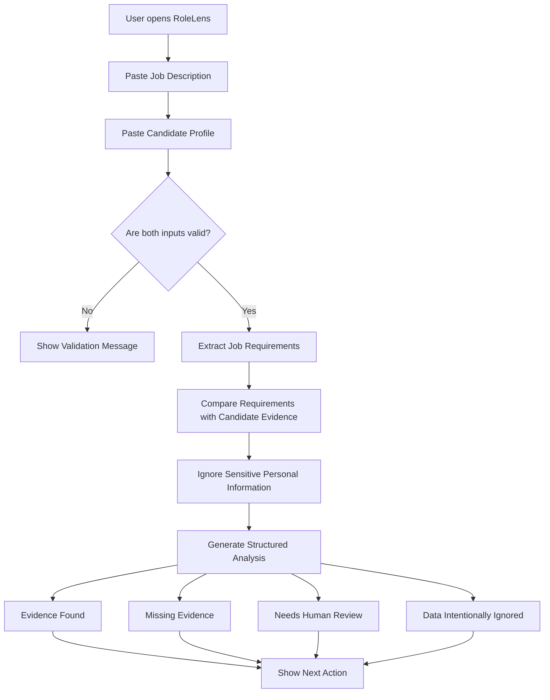
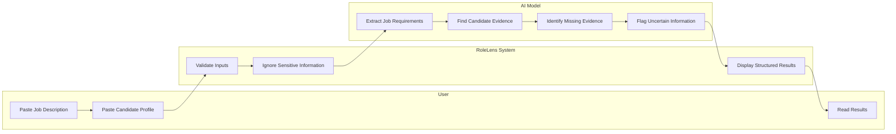

# RoleLens — Week 2 Ship Packet
## 1. Problem in My Words
Algorithms are increasingly used to evaluate people in processes such as recruiting and job applications. The problem is that even when an algorithm is technically accurate, it can still create unfair outcomes by relying on incomplete information, hidden assumptions, or personal characteristics that should not influence the decision.
Job seekers often receive a score or a rejection without understanding what information influenced the result. RoleLens attacks this problem by showing the evidence behind a job-to-candidate comparison instead of reducing a person to a single numerical score.

## 2. Exact User
The primary user is a university student or early-career professional applying for jobs who wants to understand how their experience compares with a job description.
The user is comfortable using basic digital tools but does not necessarily understand how applicant tracking systems or AI-based screening systems work.

## 3. Success Definition

Before the module closes, a user can:

1. Paste a job description.
2. Paste a candidate profile or resume.
3. Click **Analyze Match**.
4. Receive a structured explanation containing:
   - Evidence Found
   - Missing Evidence
   - Items Requiring Human Review
   - Sensitive Information Intentionally Ignored
5. Understand at least one concrete action they could take before applying.

The product will not generate a numerical candidate score.

## 4. Generated Mockup

**Insert the AI-generated interface mockup here.**

The mockup should show:

- RoleLens title
- A text area labeled **Job Description**
- A text area labeled **Candidate Profile**
- An **Analyze Match** button
- A results area with these sections:
  - Evidence Found
  - Missing Evidence
  - Needs Human Review
  - Data We Ignore

It should also include a short note saying:

> RoleLens explains evidence. It does not decide whether a person deserves the job.


## 5. Product Flow



## 6. Swimlane



## 7. Benchmark

The closest existing solution I found is Jobscan, a platform that compares a resume with a job description and helps users identify missing skills, keywords, and other areas that may affect their application.

RoleLens is different because it does not reduce the candidate to a numerical match score. Instead, it focuses on explaining the evidence behind the comparison, separating missing information from negative evidence, identifying uncertainty, and showing which sensitive personal characteristics should not influence the analysis.

## 8. Long View

If this first version works, RoleLens could grow into a broader transparency tool for algorithmic decisions over the next three years.

The product could eventually help people understand how automated systems evaluate them in different contexts, not only job applications. The long-term goal would be to make algorithmic decisions easier to understand, question, and review while avoiding the use of sensitive personal information.

## 9. Shadow Clause

RoleLens must never use sensitive personal characteristics as evidence for whether a candidate is suitable for a job.

The system must not infer or use information such as age, gender, race, ethnicity, disability, marital status, religion, sexual orientation, photographs, or similar sensitive information.

If the available information is insufficient to make a clear comparison, RoleLens should state that human review is required instead of inventing certainty.

## 10. Scope Cut

This week I am NOT building:

- A recruiting platform
- A job board
- An applicant tracking system
- A candidate ranking system
- A credit score
- A numerical employability score
- Automatic hiring or rejection
- Resume rewriting
- User accounts
- Permanent resume storage
- Employer dashboards
- Payments

The Week 2 version only compares one candidate profile with one job description and explains the evidence behind the comparison.

## 11. Architecture and Stack

| Component | Technology | Purpose |
|---|---|---|
| Frontend | Next.js + TypeScript | Build the user interface |
| Styling | Tailwind CSS | Create a simple responsive design |
| AI | Gemini API | Analyze the job description and candidate profile |
| Structured Output | JSON | Keep AI responses consistent |
| Validation | Zod | Validate user inputs and AI output |
| Hosting | Vercel | Deploy the application |
| Repository | GitHub | Version control and project history |

No database is required for the Week 2 version.

Candidate information is analyzed during the request and is not intentionally stored by the application.

## 12. Expected Structured Output

```json
{
  "evidenceFound": [
    {
      "requirement": "Financial analysis",
      "evidence": "The candidate mentions experience analyzing financial statements."
    }
  ],
  "missingEvidence": [
    {
      "requirement": "SQL",
      "reason": "No SQL experience is mentioned in the candidate profile."
    }
  ],
  "humanReview": [
    {
      "item": "Leadership experience",
      "reason": "The candidate mentions teamwork, but there is not enough information to confirm leadership responsibility."
    }
  ],
  "ignoredData": [
    "age",
    "gender",
    "race",
    "marital status",
    "religion",
    "disability"
  ],
  "nextAction": "Add a specific example showing your experience with financial analysis."
}
```

## 13. Security Floor

### Secrets

The Gemini API key will never be committed to GitHub. It will only be stored as an environment variable in Vercel.

### Personal Data

The demo will use invented candidate information only.

The Week 2 version will not permanently store resumes, candidate profiles, or job descriptions.

### Input Validation

Both text fields will include:

- Minimum length validation
- Maximum length validation
- Empty-input validation
- Type validation

Invalid input will be rejected before an AI request is sent.

### AI Output Validation

The response generated by the AI will be checked against the expected structured format before being displayed to the user.

### Sensitive Information

RoleLens will not use sensitive personal characteristics such as age, gender, race, ethnicity, disability, religion, marital status, sexual orientation, or photographs when analyzing candidate suitability.

## 14. Test Plan

### Test 1 — Normal Input

**Input:** A valid job description and a valid candidate profile.

**Expected Result:** RoleLens displays Evidence Found, Missing Evidence, Needs Human Review, Data Intentionally Ignored, and a next action.

### Test 2 — Empty Job Description

**Input:** The job description field is empty.

**Expected Result:** The user receives a validation message and no AI request is sent.

### Test 3 — Empty Candidate Profile

**Input:** The candidate profile field is empty.

**Expected Result:** The user receives a validation message and no analysis is generated.

### Test 4 — Sensitive Information

**Input:** The candidate profile includes age, gender, marital status, or other sensitive information.

**Expected Result:** Sensitive characteristics are not used to evaluate the candidate.

### Test 5 — Missing Qualification

**Input:** The job description requires SQL, but the candidate profile does not mention SQL.

**Expected Result:** SQL appears under Missing Evidence.

### Test 6 — Ambiguous Information

**Input:** The candidate says they worked with a team, but the job requires leadership experience.

**Expected Result:** Leadership appears under Needs Human Review instead of being assumed.

### Test 7 — Excessively Long Input

**Input:** The user enters text beyond the allowed character limit.

**Expected Result:** The application rejects the input and displays a clear validation message.

## 15. Definition of Done

The Week 2 slice is complete when:

- The live Vercel URL works.
- A user can paste a job description and candidate profile.
- The application returns structured AI output.
- The application does not generate a numerical candidate score.
- Sensitive personal characteristics are excluded from the analysis.
- Input validation works correctly.
- At least one bug has been identified and fixed.
- The corrected version has been redeployed.
- A synthetic persona has completed the product test.
- The most important confusion found during the persona test has been fixed.
- The repository contains at least five meaningful Git commits.
- The project has been deployed at least twice.

- 
